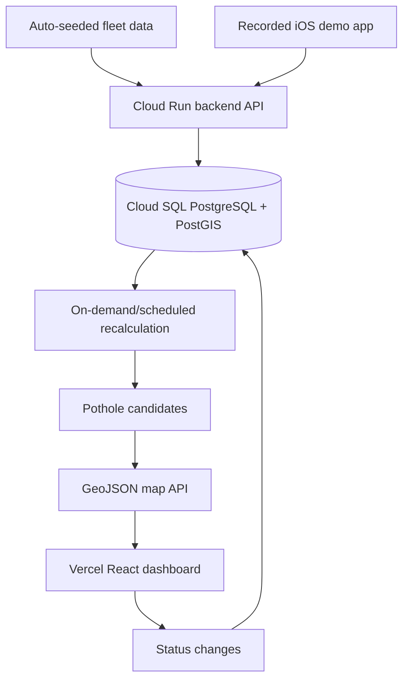

# Passive Pothole Detection Demo Architecture Brief

## Summary

This demo MVP will deploy a Vercel dashboard, a GCP Cloud Run backend, and a Cloud SQL/PostGIS database that turn iPhone-originated and simulated road-impact events into clustered pothole candidates on a municipal heat map. The iOS app remains part of the demo as recorded proof that a phone can send real impact events into the deployed backend, while seeded fleet data makes the dashboard credible at city scale.

---

## Problem Frame

Cities and contractors usually learn about potholes through manual reports, inspections, or complaints. That creates delayed and incomplete coverage because most drivers do not report road damage after hitting it, and manual inspection does not scale to every road segment every day.

The demo needs to show the passive-inspection thesis without depending on App Store approval or a real fleet. The credible version is a hybrid: a native iOS app proves the phone-to-backend path in a recorded clip, and the deployed backend auto-seeds realistic fleet events so the dashboard can show clustering, confidence, severity, status, and map interactions.

The riskiest real product assumption is background passive sensing on iOS. iOS limits background work, precise location, high-rate sensor collection, and app relaunch behavior. For this demo, the app can request the relevant permissions and support bounded passive collection, but it should not promise reliable detection after force-quit or reboot until the app is relaunched.

---

## System Flow

The dashboard must not be static mock data. Seeded fleet events and the recorded iOS event both flow through the same deployed ingestion, persistence, clustering, scoring, and map API path.

---

## Actors

- A1. Demo viewer: Watches the deployed dashboard and recorded iOS proof video.
- A2. iOS demo app: Collects basic motion/location context and uploads a real demo impact event to the deployed backend.
- A3. Cloud Run backend: Validates, stores, clusters, scores, and serves impact/candidate data.
- A4. Auto-seeded fleet simulator: Creates realistic synthetic events on deploy/startup so the map has credible candidate density.
- A5. Dashboard user: Opens the Vercel dashboard, filters heat areas, inspects details, and changes candidate status.

---

## Key Flows

- F1. Recorded iOS proof
  - **Trigger:** The iOS app is run on a demo iPhone for a screen recording.
  - **Actors:** A1, A2, A3
  - **Steps:** The app requests Always Location and motion access, collects basic motion/location context, creates or detects a demo impact event, uploads the event plus a short sensor window, and the deployed backend accepts it.
  - **Outcome:** The recorded video proves the product is not only a dashboard simulation.
  - **Covered by:** R1, R2, R3, R4, R5

- F2. Candidate creation and scoring
  - **Trigger:** Seeded or iOS impact events arrive, or recalculation runs.
  - **Actors:** A3, A4
  - **Steps:** Events are assigned to nearby candidates by radius, candidates are rescored with transparent weighted rules, and map-ready records are updated.
  - **Outcome:** The system maintains pothole candidates with explainable confidence and severity.
  - **Covered by:** R8, R9, R10, R11, R12

- F3. Dashboard triage
  - **Trigger:** A viewer opens the deployed dashboard.
  - **Actors:** A5
  - **Steps:** The dashboard loads GeoJSON from the Cloud Run API, renders severity heat/circle areas over Mapbox, supports filtering, and opens a detail card when a heat area is selected.
  - **Outcome:** The viewer can see a credible operational dashboard and inspect how confidence/severity are derived.
  - **Covered by:** R13, R14, R15, R16, R17, R18, R19, R20

- F4. Auto-seeded demo
  - **Trigger:** The backend deploys or starts with demo seeding enabled.
  - **Actors:** A3, A4, A5
  - **Steps:** The backend creates synthetic vehicles and impact events around seeded locations, recalculates candidates, and exposes them to the dashboard.
  - **Outcome:** The dashboard is immediately useful after deployment without depending on live fleet data.
  - **Covered by:** R21, R22, R23

---

## 1. Recommended Tech Stack

**Confirmed demo stack**
- iOS app: Native Swift + SwiftUI.
- iOS sensing: Core Motion for acceleration/device motion and Core Location for GPS, speed, heading, accuracy, and bounded passive collection experiments.
- Backend API: Fastify + TypeScript deployed on Google Cloud Run.
- Database: Cloud SQL for PostgreSQL with PostGIS enabled.
- Candidate recalculation: synchronous ingestion plus on-demand/scheduled recalculation; no queue for the demo.
- Dashboard: React + Vite + TypeScript deployed on Vercel.
- Map: Mapbox GL JS.
- API contract for map: GeoJSON FeatureCollection.
- Frontend/backend boundary: Vercel dashboard calls the Cloud Run API directly through a CORS allowlist for the Vercel domain.
- Auth: no dashboard auth for the demo.

**Why this stack**
- Native Swift keeps the iOS sensor, permission, and background behavior explicit.
- Cloud Run + Fastify keeps the API deployable without Kubernetes or server management.
- Cloud SQL/PostGIS fits the geospatial core: proximity queries, candidate assignment, map bounds, and future road-segment logic.
- React/Vite on Vercel is the quickest path to a polished deployed dashboard.
- Mapbox GL JS gives strong road-map presentation and controllable heat/circle layers.

**Stack cautions**
- Do not build Android support in the demo.
- Do not use React Native or another cross-platform mobile framework unless the platform strategy changes later.
- Do not start with ML infrastructure.
- Do not add full authentication, user management, or production privacy workflows for the demo.

---

## 2. High-Level System Architecture

The demo MVP has five layers:

- iOS proof layer: A native iPhone app sends a real demo event into the deployed backend for a recorded proof clip.
- Event ingestion layer: Cloud Run accepts iOS and seeded impact events, validates payloads, deduplicates obvious repeats, and stores events.
- Geospatial assignment layer: PostGIS-backed logic assigns events to nearby pothole candidates using a configurable radius.
- Scoring layer: Transparent weighted rules calculate confidence, severity, heat radius, and heat intensity.
- Dashboard layer: Vercel-hosted React app renders active candidates on Mapbox with filters, clickable details, and status changes.

The system does not need Redis, Pub/Sub, or Cloud Tasks for the demo. Recalculation can run after seed/upload operations and optionally on a scheduled endpoint.

---

## 3. iOS App Modules

- Permission module: Requests Always Location and motion access up front for the demo build.
- Bounded passive module: Uses motion activity plus location/speed gating where practical, without promising operation after force-quit or reboot until the app is relaunched.
- Sensor sampler: Reads Core Motion accelerometer/device-motion data.
- Location sampler: Reads Core Location coordinates, speed, heading, timestamp, and accuracy.
- Basic detector: Acceleration spike + speed/GPS gate + cooldown. This is not the demo centerpiece.
- Upload client: Sends a real demo impact event plus a short sensor window to the Cloud Run backend.
- Event buffer: Stores an event locally if the network fails during recording.
- Demo proof view: Makes it easy to record the app sending an event that later appears in the backend/dashboard.
- Guardrails: Pause or reduce collection on Low Power Mode and very low battery; otherwise prioritize collecting enough data for proof.

The iOS app does not need App Store readiness. It needs to be installable on a demo device and reliable enough to record a short proof clip.

---

## 4. Backend Modules

- API gateway: Fastify server with request validation, rate limits, and CORS allowlist for the Vercel dashboard.
- Impact ingestion service: Accepts iOS and seeded impact events and stores accepted records.
- Deduplication service: Suppresses obvious duplicate events from the same source/session around the same timestamp/location.
- Demo seed service: Creates synthetic vehicles, sessions, and events on deploy/startup or reseed.
- Candidate assignment service: Assigns events to nearby candidates within a configurable radius.
- Scoring service: Calculates confidence, severity, heat radius, heat intensity, and evidence summaries.
- Candidate API: Serves GeoJSON FeatureCollections for the map and JSON detail records for the detail card.
- Status workflow service: Records dashboard status changes.
- Observability module: Tracks seed runs, ingestion counts, candidate recalculation, API errors, and dashboard data freshness.

---

## 5. Database Schema

Use Cloud SQL for PostgreSQL with PostGIS. Keep the schema demo-focused but real.

**anonymous_sources**
- id
- source_type: ios_demo or seeded_demo
- created_at
- app_version

**drive_sessions**
- id
- anonymous_source_id
- started_at
- ended_at
- event_count
- collection_mode: bounded_passive, detector, demo_send, seeded

**impact_events**
- id
- anonymous_source_id
- drive_session_id
- location geometry point
- latitude
- longitude
- gps_accuracy_meters
- speed_kph
- heading_degrees
- impact_magnitude
- vertical_acceleration
- timestamp
- uploaded_at
- source_type: ios_demo or seeded_demo
- sensor_window_summary
- accepted
- rejection_reason

**pothole_candidates**
- id
- location geometry point
- latitude
- longitude
- approximate_address
- confidence_score
- severity_level
- heat_radius_meters
- heat_intensity
- unique_source_count
- event_count
- average_impact_magnitude
- peak_impact_magnitude
- first_detected_at
- last_detected_at
- status: monitoring, verified, assigned, repaired, recurring
- last_scored_at

**candidate_events**
- pothole_candidate_id
- impact_event_id
- distance_meters_from_candidate

**status_history**
- id
- pothole_candidate_id
- old_status
- new_status
- changed_at
- note

**known_road_features**
- id
- feature_type: speed_bump, rail_crossing, manhole_area, bridge, construction_zone, other
- location or geometry
- confidence
- source
- active_from
- active_until

**demo_runs**
- id
- started_at
- ended_at
- seed
- target_locations_count
- synthetic_vehicle_count

---

## 6. API Routes

**iOS app**
- `POST /api/impact-events`: uploads one demo impact event plus summary sensor window.
- `POST /api/impact-events/batch`: uploads buffered events if needed.
- `GET /api/mobile/config`: returns thresholds, sampling settings, minimum speed, and feature flags.

**Dashboard**
- `GET /api/pothole-candidates/map`: returns a GeoJSON FeatureCollection with filter support for severity, confidence, status, and last detected time.
- `GET /api/pothole-candidates/:id`: returns candidate detail, evidence summary, and status history.
- `PATCH /api/pothole-candidates/:id/status`: changes candidate status.
- `GET /api/dashboard/summary`: returns counts by severity/status and recent changes.

**Demo/admin utilities**
- `POST /api/demo/seed`: seeds or reseeds synthetic vehicles and repeated impacts.
- `DELETE /api/demo/runs/:id`: clears one demo run if needed.
- `POST /api/pothole-candidates/recalculate`: recalculates candidate assignment and scores after seed or iOS demo uploads.
- `GET /api/health`: supports Cloud Run health checks and quick debugging.

---

## 7. Detection Algorithm for MVP

Detection is not the demo centerpiece. The dashboard/demo value comes from backend clustering, scoring, and visualization. The iOS detector only needs enough credibility for recorded proof and future field testing.

1. Use bounded passive iOS collection where practical.
2. Track Core Motion acceleration/device-motion readings.
3. Maintain a rolling baseline of acceleration magnitude.
4. Require a configurable speed threshold and acceptable GPS accuracy.
5. Detect a candidate impact when acceleration or vertical acceleration exceeds a threshold.
6. Apply a short cooldown window so one hit does not create multiple events.
7. Suppress only the most obvious phone-handling cases.
8. Attach timestamp, location, speed, heading, impact magnitude, vertical acceleration, GPS accuracy, source ID, session ID, app version, and source type.
9. Upload the accepted impact event plus a short sensor window, not a full trip route.

Thresholds should be configurable. Fine-grained false-positive tuning is deferred because detection will not be live-demoed.

---

## 8. Clustering/Scoring Algorithm for MVP

**Candidate assignment**
- Use radius-based candidate assignment first.
- For each accepted event, find an existing candidate within a configurable radius, such as 10-20 meters.
- If a candidate exists, attach the event and update the candidate centroid/evidence summary.
- If no candidate exists, create a new monitoring candidate.
- Recalculate candidates after seeding, after iOS demo uploads, and on a scheduled cadence if useful.
- Use PostGIS distance queries; defer DBSCAN until real event density requires it.

**Confidence score**
- Use a transparent weighted score.
- Increase confidence with unique source count, total event count, recency, and GPS tightness.
- Penalize poor GPS quality, known-feature overlap, stale evidence, and one source dominating the evidence.
- Keep one-source/one-event candidates visibly low confidence.

**Severity score**
- Use average and peak impact magnitude as the base.
- Adjust severity by confidence so a single large impact does not become urgent on its own.
- Convert severity to dashboard levels:
  - Yellow: low severity or low urgency.
  - Orange: medium severity.
  - Red: high severity or urgent repair candidate.

---

## 9. Live Map Implementation Plan

The map should be an operational triage surface, not a decorative visualization.

- Use Mapbox GL JS with a road-first basemap.
- Fetch candidates from the Cloud Run API as a GeoJSON FeatureCollection.
- Render candidates as heat/circle overlays whose color maps to severity and whose radius/opacity maps to confidence, detection count, and impact magnitude.
- Use heatmap layers for zoomed-out density and circle layers for clickable candidate areas at operational zoom levels.
- Keep active/unresolved candidates visible by default.
- Provide filters for severity, confidence, status, and last detected time.
- On click/tap, open a side panel or floating detail card with confidence, severity, address, coordinates, unique source count, average impact magnitude, first detected, last detected, and status.
- Allow status changes from the detail card.
- Refresh with polling first; no streaming is needed for the demo.
- Keep high-severity red areas visually dominant and avoid UI that hides the map.

Clickable heat areas need explicit feature layers. A pure heatmap is good for density but not enough for inspection.

---

## 10. Demo Mode Implementation Plan

Demo mode should exercise the real ingestion, clustering, scoring, and dashboard flow.

- Auto-seed synthetic vehicles, drive sessions, and impact events when the backend starts or when the seed endpoint is called.
- Seed several Toronto-like road locations with different severities and confidence levels.
- Generate multiple unique source detections near the same location with realistic GPS jitter, heading variation, speed variation, and timestamps.
- Include false-positive examples such as speed bumps and rail crossings so confidence suppression can be shown.
- Include at least one seeded location where the recorded iOS event can appear or increase evidence.
- Tag seeded and iOS demo data so it can be cleared when needed.
- Avoid hard-coding dashboard candidates directly; demo data should pass through normal backend logic.

---

## 11. Main Edge Cases and Handling

- Speed bumps: downweight using known road features and repeated low-severity patterns.
- Train tracks: downweight when overlapping known rail crossings or when impacts form a linear crossing pattern.
- Manhole covers: keep as unresolved false-positive risk unless known feature data is available.
- Construction plates: defer full handling; optionally seed one temporary known-feature example.
- Rough road segments: represent as broader heat zones rather than pretending every cluster is a single pothole.
- Phone dropped or moved: suppress only obvious cases for demo; deeper handling is later.
- Hard braking: defer advanced suppression unless it appears in demo recordings.
- Poor GPS accuracy: reject or downweight events above the accuracy threshold.
- Multi-lane ambiguity: avoid lane-level claims; show approximate candidate zones.
- Duplicate events: dedupe by source/session/time/location.
- Battery drain: use moderate guardrails; pause or reduce collection on Low Power Mode and very low battery.
- Public demo URL: no auth is acceptable because data is disposable, but avoid sensitive real user data.

---

## 12. Step-by-Step Build Plan

1. Create Cloud SQL/PostGIS schema and local seed data.
2. Build the Fastify Cloud Run API with impact ingestion, demo seed, candidate recalculation, and GeoJSON map endpoints.
3. Implement radius-based candidate assignment and transparent weighted scoring.
4. Deploy the backend to Cloud Run and connect it to Cloud SQL.
5. Build the React/Vite dashboard with Mapbox, filters, clickable heat/circle layers, and detail/status cards.
6. Deploy the dashboard to Vercel and configure Cloud Run CORS for the Vercel domain.
7. Add auto-seeded demo data so the dashboard is populated immediately after deploy.
8. Build the native SwiftUI iOS demo app with permission flow, basic sensing, and event upload.
9. Record the iOS app sending a demo impact event and show the deployed dashboard reflecting the pipeline.
10. Polish the visual dashboard and demo script.

---

## 13. What to Avoid Building in the MVP

- Android support.
- App Store distribution.
- Full continuous GPS trip-history productization.
- Driver route playback.
- Camera, audio, satellite imagery, dashcam analysis, or computer vision.
- Machine-learning pothole classification.
- Lane-level precision claims.
- Automated repair dispatch into municipal systems.
- Public consumer reporting/social features.
- Predictive maintenance forecasting.
- Queues, Pub/Sub, Redis, or complex real-time streaming infrastructure before polling/on-demand recalculation proves insufficient.
- Full authentication/user management for the demo.
- Production privacy retention workflows and deletion-request handling.
- App Store-ready background sensing guarantees.

---

## Requirements

**iOS proof app**
- R1. The iOS demo app must be native Swift/SwiftUI.
- R2. The iOS app must request Always Location and motion access up front for the demo build.
- R3. The iOS app must support bounded passive collection, without promising detection after force-quit or reboot until relaunched.
- R4. The iOS app must upload a real demo impact event plus a short sensor window to the deployed backend.
- R5. The iOS app must provide a recordable proof path showing that the phone can affect backend/dashboard data.

**Backend and data**
- R6. The backend must run on GCP Cloud Run.
- R7. The database must be Cloud SQL for PostgreSQL with PostGIS.
- R8. The backend must validate, store, and deduplicate incoming iOS and seeded impact events.
- R9. The backend must assign nearby impact events into pothole candidates using radius-based geospatial logic.
- R10. Candidate confidence must use a transparent weighted rule score based on unique sources, event count, recency, GPS spread, and penalties.
- R11. Candidate severity must use average/peak impact magnitude adjusted by confidence.
- R12. Recalculation must run on demand after seeding/uploads and may also run on a schedule.

**Dashboard and map**
- R13. The dashboard must be a React/Vite app deployed on Vercel.
- R14. The Cloud Run API must allow the Vercel dashboard domain through CORS.
- R15. The map endpoint must return a GeoJSON FeatureCollection.
- R16. The dashboard must show pothole candidates on a Mapbox road map as yellow, orange, and red heat/circle areas.
- R17. The dashboard must default to active or unresolved candidates.
- R18. The dashboard must support filtering by severity, confidence, status, and last detected time.
- R19. A dashboard user must be able to click or tap a heat area and inspect an expanded detail card.
- R20. A dashboard user must be able to change status to monitoring, verified, assigned, repaired, or recurring.

**Demo**
- R21. Demo data must be automatically seeded on deploy/startup or reseed.
- R22. Demo data must flow through the normal ingestion, candidate assignment, scoring, and dashboard pipeline rather than hard-coded map candidates.
- R23. The deployed dashboard does not require authentication for the demo.

---

## Acceptance Examples

- AE1. **Covers R4, R5, R8.** Given the iOS demo app has permission and a network connection, when it sends a demo impact event, the Cloud Run backend stores the event and it can affect candidate data.
- AE2. **Covers R9, R10, R11.** Given one event exists at a location, when recalculation runs, the candidate remains lower confidence than a candidate with several unique sources.
- AE3. **Covers R9, R10, R11, R21, R22.** Given seeded events from multiple synthetic sources exist near the same location, when scoring runs, the candidate confidence and severity increase.
- AE4. **Covers R13, R15, R16, R19.** Given active candidates exist, when a dashboard user opens the Vercel app, candidates appear as colored Mapbox heat/circle areas and selecting one opens its detail card.
- AE5. **Covers R20.** Given a candidate is visible in the detail card, when the user changes status, the status update persists and is reflected on the dashboard.
- AE6. **Covers R21, R22, R23.** Given the deployed demo has no auth, when the backend is seeded, the dashboard is immediately populated with candidates created by the real backend pipeline.

---

## Success Criteria

- The deployed Vercel dashboard opens publicly and shows credible pothole heat areas backed by Cloud Run and Cloud SQL/PostGIS data.
- A recorded iPhone demo shows a real app event being sent into the deployed backend.
- A repeated simulated pothole-like location becomes a higher-confidence candidate only after multiple unique sources contribute evidence.
- A viewer can open the dashboard, identify the highest-urgency red areas, inspect details, filter candidates, and change status.
- The system can explain why a candidate is high or low confidence without relying on a black-box model.
- The demo avoids full trip-history productization and does not expose individual driver routes.
- A planner can move from this brief into implementation planning without inventing product behavior, scope boundaries, or primary workflows.

---

## Scope Boundaries

### Deferred for later

- App Store distribution.
- Production-grade passive drive detection that works reliably after app termination.
- Android support and cross-platform mobile parity.
- Machine-learning classification trained on labeled road-impact data.
- Lane-level localization.
- Rich municipal work-order integrations.
- Automatic repair dispatch or contractor routing.
- Push-based real-time dashboard updates.
- Full known-road-feature ingestion from municipal GIS systems.
- Driver-facing gamification, rewards, or reporting history.
- Full auth, user management, privacy retention workflows, and deletion-request handling.

### Outside this product's identity

- Surveillance or route-tracking product for individual drivers.
- Dashcam/computer-vision pothole detection product.
- General-purpose fleet telematics platform.
- Public complaint/social reporting network.
- Satellite or aerial imagery road-condition analysis.

---

## Key Decisions

- Demo with a hybrid proof: Use seeded fleet data for dashboard density and a recorded iOS app event to prove the phone-to-backend path.
- Use native iOS first: Swift/SwiftUI with Core Motion and Core Location is the mobile scope.
- Accept bounded passive iOS constraints: The app can pursue passive collection, but does not promise operation after force-quit/reboot until relaunched.
- Use aggressive collection for the proof app: high-frequency sampling can run while background location is active, with moderate guardrails for Low Power Mode and very low battery.
- Prioritize deployment: Vercel frontend, Cloud Run API, and Cloud SQL/PostGIS are the target demo deployment.
- Keep backend execution simple: Synchronous ingestion plus on-demand/scheduled recalculation is enough for the demo.
- Keep scoring explainable: Weighted rules are better than ML until labeled field data exists.
- Treat heat areas as operational objects: The map must support click, filter, status, and detail workflows, not just a visual heat layer.
- Keep demo data realistic: Auto-seeded demo data should use normal ingestion and candidate assignment so it proves system behavior rather than faking the dashboard.

---

## Dependencies / Assumptions

- Demo data is disposable, so the dashboard can be deployed without authentication.
- The Vercel dashboard can call the Cloud Run API directly with a CORS allowlist.
- The recorded iOS demo can be installed outside the App Store on a demo device.
- Phone placement will vary enough that the detector must rely on configurable thresholds and quality checks.
- Municipal users can act on approximate candidate zones; lane-level certainty is not required for the demo.
- Mapbox is an acceptable dependency for the dashboard.
- Background location and sensor behavior must be validated on real iPhones, not just simulators.
- Cloud SQL for PostgreSQL supports PostGIS for the required geospatial queries.
- Cloud Run can connect to Cloud SQL for the deployed backend.

---

## MVP Reality Checks

- Passive background operation is harder than the pitch makes it sound. iOS permission, battery, and background-execution rules can dominate a production version.
- Accelerometer-only pothole detection will be noisy. For this demo, detection is not the centerpiece; confidence comes from the backend clustering/scoring story.
- Speed bumps and rail crossings may look like potholes unless known-feature suppression or operational feedback exists.
- Heatmaps are not automatically clickable business objects. The product needs candidate geometries/layers that can be selected and inspected.
- A dashboard without the recorded iOS proof may look like a pure simulation; the iOS clip exists to prevent that.

---

## Reference Notes

- Apple documents Core Motion as the framework for motion and environment-related sensor data, including accelerometer-style device motion.
- Apple imposes explicit requirements around background location behavior and permissions; these need real-device validation for the iOS proof app.
- Google Cloud SQL for PostgreSQL supports PostGIS, and Cloud Run has documented connection paths to Cloud SQL.
- Mapbox GL JS supports runtime sources/layers and heatmap layers using GeoJSON or vector sources.
- PostGIS distance queries support the first radius-based candidate assignment approach.

---

## Outstanding Questions

### Resolve Before Planning

- None.

### Deferred to Planning

- [Affects R2-R5][Technical] Decide the exact native iOS proof app screen flow and whether the recorded event comes from a detector trigger, a demo send action, or both.
- [Affects R9-R12][Technical] Choose exact initial clustering radius and scoring weights for the seeded demo data.
- [Affects R13-R20][Technical] Define the final dashboard visual layout, filters, and detail-card fields.
