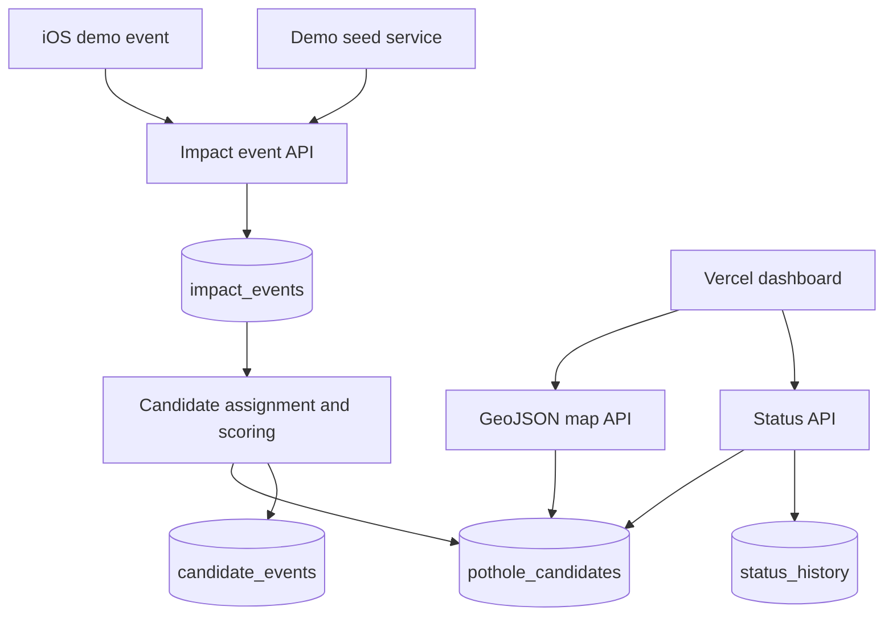
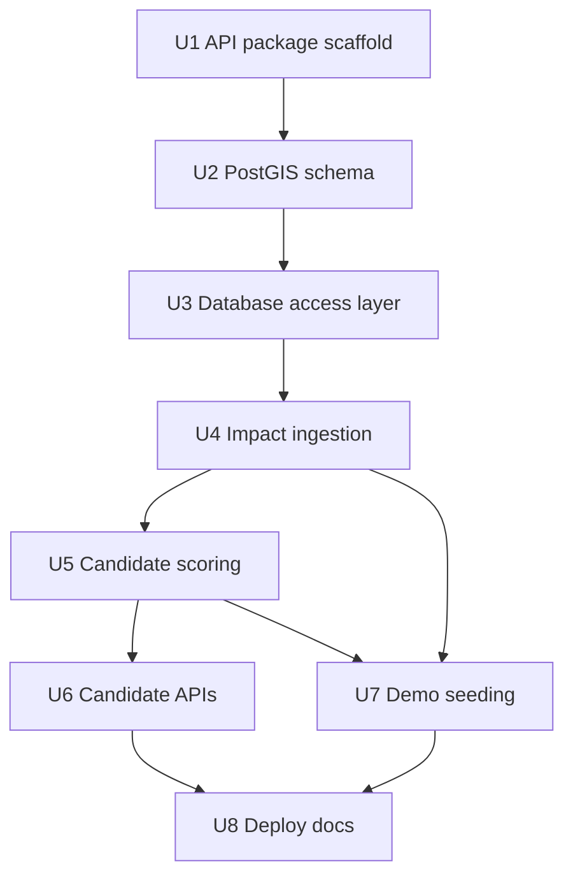

# feat: Implement backend and database

## Summary

Implement a deploy-ready Fastify API service and PostGIS database layer that turn iOS/demo impact events into persisted, scored pothole candidates for the existing dashboard contract. The backend lives as a separate `api/` package, uses Cloud SQL-compatible PostgreSQL/PostGIS migrations, and exposes ingestion, candidate GeoJSON, status, recalculation, seed, and health endpoints for the deployed demo.

---

## Problem Frame

The dashboard skeleton currently proves the municipal triage interface with local candidate fixtures. The next backend/database slice needs to make those candidates real enough for deployment: seeded and iOS-originated events must pass through the same Cloud Run API, persistence, geospatial clustering, and scoring path before the dashboard reads them (see origin: `docs/brainstorms/2026-05-10-passive-pothole-detection-requirements.md`).

---

## Requirements

- R6. The backend must run on GCP Cloud Run.
- R7. The database must be Cloud SQL for PostgreSQL with PostGIS.
- R8. The backend must validate, store, and deduplicate incoming iOS and seeded impact events.
- R9. The backend must assign nearby impact events into pothole candidates using radius-based geospatial logic.
- R10. Candidate confidence must use a transparent weighted rule score based on unique sources, event count, recency, GPS spread, and penalties.
- R11. Candidate severity must use average/peak impact magnitude adjusted by confidence.
- R12. Recalculation must run on demand after seeding/uploads and may also run on a schedule.
- R14. The Cloud Run API must allow the Vercel dashboard domain through CORS.
- R15. The map endpoint must return a GeoJSON FeatureCollection.
- R20. A dashboard user must be able to change status to monitoring, verified, assigned, repaired, or recurring.
- R21. Demo data must be automatically seeded on deploy/startup or reseed.
- R22. Demo data must flow through the normal ingestion, candidate assignment, scoring, and dashboard pipeline rather than hard-coded map candidates.
- R23. The deployed dashboard does not require authentication for the demo.

**Origin actors:** A2 iOS demo app, A3 Cloud Run backend, A4 auto-seeded fleet simulator, A5 dashboard user.

**Origin flows:** F1 recorded iOS proof, F2 candidate creation and scoring, F3 dashboard triage, F4 auto-seeded demo.

**Origin acceptance examples:** AE1 iOS event stored and affects candidate data, AE2 one event lower confidence than several unique sources, AE3 seeded events increase confidence/severity, AE4 dashboard reads map-ready candidate data, AE5 status update persists, AE6 no-auth seeded backend populates the dashboard.

---

## Scope Boundaries

### Deferred for later

- App Store distribution.
- Production-grade passive drive detection that works reliably after app termination.
- Android support and cross-platform mobile parity.
- Machine-learning classification trained on labeled road-impact data.
- Lane-level localization.
- Rich municipal work-order integrations.
- Automatic repair dispatch or contractor routing.
- Push-based real-time dashboard updates.
- Full known-road-feature ingestion from municipal GIS systems.
- Driver-facing gamification, rewards, or reporting history.
- Full auth, user management, privacy retention workflows, and deletion-request handling.

### Outside this product's identity

- Surveillance or route-tracking product for individual drivers.
- Dashcam/computer-vision pothole detection product.
- General-purpose fleet telematics platform.
- Public complaint/social reporting network.
- Satellite or aerial imagery road-condition analysis.

### Deferred to Follow-Up Work

- iOS app implementation: this plan only keeps the ingestion contract ready for the recorded iOS proof path.
- Dashboard API wiring: this plan preserves the existing dashboard candidate shape and GeoJSON contract, but leaves the current fixture-to-API swap for a separate frontend slice.
- Vercel deployment changes: this plan provides Cloud Run CORS/API requirements; dashboard hosting remains in the existing dashboard deployment work.
- Terraform or full GCP infrastructure-as-code: this plan documents deploy prerequisites but keeps infrastructure automation out of the MVP implementation.
- Production authentication, authorization, rate limiting policy, and audit controls: no-auth demo is an explicit origin decision.

---

## Context & Research

### Relevant Code and Patterns

- `src/domain/candidates.ts` already defines the dashboard-facing `PotholeCandidate`, `CandidateStatus`, severity values, filter behavior, status update behavior, and GeoJSON conversion shape. The backend should serve compatible candidate properties so the frontend can switch from fixtures with minimal churn.
- `src/data/demoCandidates.ts` provides the current fixture data and field naming that the backend map endpoint should preserve.
- `src/domain/candidates.test.ts` and `src/App.test.tsx` show the current Vitest style and the level of scenario-specific assertions expected in this repo.
- `README.md` documents the current dashboard-only app. Backend work should update it with a backend/database section instead of replacing the existing dashboard instructions.
- No `docs/solutions/` or `STRATEGY.md` files exist in this repo, so there are no local institutional learnings or strategy docs to carry forward.

### External References

- Google Cloud documents Cloud Run to Cloud SQL connection options for PostgreSQL: https://cloud.google.com/sql/docs/postgres/connect-run
- Google Cloud documents Cloud SQL PostgreSQL extension support, including PostGIS: https://cloud.google.com/sql/docs/postgres/extensions
- PostGIS documents `ST_DWithin` for radius-based distance checks: https://postgis.net/docs/ST_DWithin.html
- Fastify documents JSON-schema request validation and serialization: https://fastify.dev/docs/latest/Reference/Validation-and-Serialization/
- Fastify documents route testing with injection: https://fastify.dev/docs/v5.7.x/Guides/Testing/
- node-postgres documents pooled database access for web apps: https://node-postgres.com/features/pooling

---

## Key Technical Decisions

| Decision | Rationale |
|---|---|
| Create a separate `api/` package | Keeps the Cloud Run backend deployable without turning the existing root Vite dashboard into a mixed runtime package. |
| Use Fastify with TypeScript and schema validation | Matches the origin stack decision while giving explicit request/response validation for iOS, seed, dashboard, and status endpoints. |
| Use `pg` plus SQL migrations instead of an ORM | PostGIS proximity queries, geometry indexes, and scoring aggregates are central enough that direct SQL is clearer than fighting ORM geospatial abstractions. |
| Use local Docker PostGIS for development/test parity | Radius clustering and geospatial indexes should be tested against PostgreSQL/PostGIS behavior rather than a memory substitute without spatial support. |
| Store accepted impact events and rebuild candidates deterministically | Demo correctness depends on transparent data flow; deterministic recalculation makes seeded and iOS events easier to verify and explain. |
| Keep ingestion synchronous for the MVP | The demo does not need Pub/Sub or worker orchestration; synchronous insert plus candidate recalculation is simpler and easier to deploy. |
| Expose GeoJSON with dashboard-compatible candidate properties | Preserves the current Mapbox/dashboard shape and reduces frontend integration risk in the next slice. |
| Gate auto-seeding behind demo configuration | Demo data should populate deploys when intended, without surprising future environments that point at shared or persistent databases. |
| Keep migrations as an explicit deployment operation | Cloud Run startup should not unexpectedly mutate schema on every instance boot; migration execution belongs in documented deploy/release steps. |

---

## Open Questions

### Resolved During Planning

- API/package location: create a separate `api/` service package rather than mixing server code into the root dashboard app.
- Database abstraction: use direct SQL with `pg` and migrations for PostGIS-heavy behavior.
- Dashboard integration scope: backend serves the future contract; swapping the dashboard from fixtures to live API is a follow-up frontend slice.
- Recalculation architecture: synchronous/on-demand recalculation is sufficient for demo scale.

### Deferred to Implementation

- Exact scoring weights: choose initial weights while implementing seeded data so confidence/severity examples satisfy AE2 and AE3 without pretending they are production-calibrated.
- Exact clustering radius default: start within the origin's 10-20 meter range, then adjust against seeded Toronto locations if demo candidates merge too aggressively or fragment too much.
- Cloud Run environment values: finalize specific secret names, Cloud SQL instance connection name, and Vercel origin once the GCP/Vercel projects exist.
- Migration runner choice details: implementation may choose the smallest migration runner that supports ordered SQL migrations and works cleanly in the `api/` package.

---

## Output Structure

    api/
      package.json
      tsconfig.json
      Dockerfile
      docker-compose.yml
      migrations/
      src/
        config/
        db/
        domain/
        routes/
        services/
        server.ts
      test/
    docs/
      plans/
        2026-05-10-001-feat-backend-database-plan.md
    README.md
    package.json

The tree is the intended package shape. The implementer may adjust filenames inside `api/src/` if the final Fastify/service organization is clearer, but the service should remain isolated from the root Vite dashboard.

---

## High-Level Technical Design

> *This illustrates the intended approach and is directional guidance for review, not implementation specification. The implementing agent should treat it as context, not code to reproduce.*

Candidate assignment should remain deliberately simple for the MVP: accepted events are grouped by PostGIS radius, candidate centers and evidence summaries are recalculated, and confidence/severity fields are persisted for fast map reads. Status changes are operational overrides and must persist across candidate rescoring.

---

## Implementation Units

### U1. API Package Scaffold

**Goal:** Create an isolated TypeScript Fastify service package with runtime configuration, app factory, health route, test harness, and root scripts that let the repo operate as dashboard plus backend.

**Requirements:** R6, R23.

**Dependencies:** None.

**Files:**
- Create: `api/package.json`
- Create: `api/tsconfig.json`
- Create: `api/src/server.ts`
- Create: `api/src/app.ts`
- Create: `api/src/config/env.ts`
- Create: `api/src/routes/health.ts`
- Create: `api/src/test/appTestHarness.ts`
- Test: `api/src/config/env.test.ts`
- Test: `api/src/routes/health.test.ts`
- Modify: `package.json`
- Modify: `README.md`

**Approach:**
- Keep the root dashboard package intact and add backend helper scripts that delegate into `api/`.
- Build Fastify through an app factory so route tests can use Fastify injection without opening a network port.
- Centralize environment parsing for port, database URL/socket settings, CORS origin, demo seed flags, clustering radius, scoring knobs, and deployment mode.
- Keep no-auth behavior explicit in configuration and docs so it is not mistaken for production-ready security.

**Execution note:** Start with failing route/config tests before filling in the service scaffold.

**Patterns to follow:**
- Match the existing repo's TypeScript/Vitest testing posture from `src/domain/candidates.test.ts`.
- Keep documentation additions consistent with the concise deployment notes in `README.md`.

**Test scenarios:**
- Happy path: valid backend environment values load into typed configuration with expected defaults for demo-safe settings.
- Edge case: missing optional values fall back to local development defaults without requiring GCP configuration.
- Error path: invalid numeric or enum-like environment values fail startup configuration with a clear validation failure.
- Happy path: `GET /api/health` returns an ok response through Fastify injection.

**Verification:**
- The backend package can typecheck and test independently from the dashboard.
- The root repo still supports the existing dashboard test/build workflow.
- Health route behavior is test-covered without depending on a live database.

---

### U2. PostGIS Schema and Local Database

**Goal:** Add ordered database migrations and local PostGIS support for anonymous sources, drive sessions, impact events, pothole candidates, candidate evidence, status history, known road features, and demo runs.

**Requirements:** R7, R8, R9, R10, R11, R20, R21, R22.

**Dependencies:** U1.

**Files:**
- Create: `api/migrations/`
- Create: `api/src/db/migrate.ts`
- Create: `api/src/db/schema.ts`
- Create: `api/docker-compose.yml`
- Create: `api/src/test/databaseTestHarness.ts`
- Test: `api/src/db/schema.integration.test.ts`
- Modify: `api/package.json`
- Modify: `README.md`

**Approach:**
- Enable PostGIS in the first migration and represent event/candidate location as geospatial points suitable for radius queries.
- Add relational tables that match the origin entities while keeping demo fields intentionally minimal.
- Add indexes for time, status, source/session dedupe, and geospatial candidate lookup.
- Preserve both numeric latitude/longitude fields and geometry fields if that keeps the dashboard contract and SQL queries straightforward.
- Use local Docker PostGIS for integration tests that need real spatial behavior.

**Execution note:** Add migration/schema verification before implementing repository behavior that depends on the schema.

**Patterns to follow:**
- Use repo-relative docs and scripts consistent with the existing README.
- Keep schema names aligned with the origin document's entity names where possible.

**Test scenarios:**
- Integration: migrations run against a fresh PostGIS database and create all required tables, enums/checks, and spatial indexes.
- Integration: PostGIS extension is available before geospatial columns or indexes are created.
- Edge case: rerunning migration status/check logic does not corrupt an already-migrated local database.
- Error path: a database without PostGIS support fails migration clearly instead of creating a half-valid schema.

**Verification:**
- A fresh local PostGIS database can be migrated from empty to current schema.
- The schema supports the candidate fields already consumed by `src/domain/candidates.ts`.
- Integration tests prove geospatial capability exists before candidate assignment work begins.

---

### U3. Database Access and Repository Layer

**Goal:** Build a small database access layer around pooled PostgreSQL connections, transactions, and repository functions for events, candidates, status history, known road features, and demo runs.

**Requirements:** R7, R8, R9, R20, R21.

**Dependencies:** U2.

**Files:**
- Create: `api/src/db/pool.ts`
- Create: `api/src/db/transaction.ts`
- Create: `api/src/repositories/impactEventsRepository.ts`
- Create: `api/src/repositories/candidatesRepository.ts`
- Create: `api/src/repositories/statusHistoryRepository.ts`
- Create: `api/src/repositories/demoRunsRepository.ts`
- Test: `api/src/repositories/impactEventsRepository.integration.test.ts`
- Test: `api/src/repositories/candidatesRepository.integration.test.ts`
- Test: `api/src/repositories/statusHistoryRepository.integration.test.ts`

**Approach:**
- Keep SQL at repository boundaries so service modules can express ingestion, assignment, and scoring in domain terms.
- Use pooled connections for API requests and explicit transactions for multi-table writes.
- Keep repository return shapes close to API/domain types while avoiding frontend-only assumptions in persistence code.
- Include geospatial helper queries for nearest candidate lookup and distance-to-candidate evidence.

**Execution note:** Implement repository integration tests against local PostGIS before wiring routes to repositories.

**Patterns to follow:**
- Preserve property naming compatibility with `src/domain/candidates.ts` at the service/API boundary.
- Use Fastify route tests for HTTP behavior and repository integration tests for DB behavior rather than over-mocking SQL.

**Test scenarios:**
- Happy path: inserting an impact event persists source/session references and returns the stored event.
- Happy path: inserting and reading a candidate returns dashboard-compatible fields and geospatial coordinates.
- Integration: nearest-candidate lookup finds a candidate within the configured radius and excludes one outside it.
- Integration: status history insert records old/new status and can be read for a candidate detail response.
- Error path: repository transaction rollback prevents partial writes when a later operation fails.

**Verification:**
- Repository tests cover the persistence operations required by ingestion, scoring, map reads, detail reads, and status changes.
- Services can depend on repository APIs without embedding SQL across route handlers.

---

### U4. Impact Event Ingestion

**Goal:** Implement iOS/demo impact event validation, deduplication, persistence, and accepted/rejected event handling through `POST /api/impact-events` and optional batch upload.

**Requirements:** R8, R12, R22, AE1.

**Dependencies:** U3.

**Files:**
- Create: `api/src/domain/impactEvent.ts`
- Create: `api/src/services/impactIngestionService.ts`
- Create: `api/src/routes/impactEvents.ts`
- Test: `api/src/services/impactIngestionService.test.ts`
- Test: `api/src/routes/impactEvents.test.ts`
- Modify: `api/src/app.ts`

**Approach:**
- Validate incoming latitude, longitude, speed, heading, impact magnitude, timestamp, source/session IDs, source type, GPS accuracy, and optional sensor-window summary.
- Deduplicate obvious repeats from the same source/session near the same time/location while preserving rejection reason for visibility.
- Persist only detected impact events and summary metadata, not full trip history.
- Trigger candidate recalculation or candidate assignment after accepted events using the service boundary that U5 provides.
- Keep batch ingestion optional but useful for iOS offline buffering.

**Execution note:** Write request/response contract tests before implementing route handlers, then service tests for dedupe and accepted/rejected outcomes.

**Patterns to follow:**
- Use Fastify JSON-schema validation per official Fastify guidance.
- Keep privacy constraints from the origin document visible in payload validation and storage decisions.

**Test scenarios:**
- Covers AE1. Happy path: a valid iOS demo event is accepted, stored, and returned with an accepted status.
- Happy path: a valid seeded demo event follows the same ingestion service as an iOS event.
- Edge case: duplicate source/session/time/location submission is rejected or marked duplicate without creating extra candidate evidence.
- Edge case: poor GPS accuracy or impossible coordinates are rejected with no candidate mutation.
- Error path: malformed payloads fail at route validation and do not reach persistence.
- Integration: accepted ingestion invokes candidate assignment/recalculation through the service boundary.

**Verification:**
- iOS and seeded events share the same ingestion path.
- The backend stores impact events without storing full route history.
- Duplicate and invalid events do not inflate candidate confidence.

---

### U5. Candidate Assignment, Recalculation, and Scoring

**Goal:** Implement radius-based event clustering, candidate evidence maintenance, transparent confidence scoring, severity scoring, heat radius/intensity calculation, and on-demand recalculation.

**Requirements:** R9, R10, R11, R12, R22, AE2, AE3.

**Dependencies:** U3, U4.

**Files:**
- Create: `api/src/domain/candidate.ts`
- Create: `api/src/services/candidateAssignmentService.ts`
- Create: `api/src/services/candidateScoringService.ts`
- Create: `api/src/routes/recalculateCandidates.ts`
- Test: `api/src/services/candidateAssignmentService.integration.test.ts`
- Test: `api/src/services/candidateScoringService.test.ts`
- Test: `api/src/routes/recalculateCandidates.test.ts`
- Modify: `api/src/app.ts`

**Approach:**
- Use PostGIS radius checks to assign accepted events to existing candidates or create new monitoring candidates.
- Maintain candidate/evidence links so scoring can be recalculated from source count, event count, recency, GPS spread, impact magnitude, and known-feature penalties.
- Keep scoring rules explainable and deterministic for demo review.
- Preserve operational status when rescoring candidate metrics, unless a candidate is explicitly rebuilt as part of a full demo reseed.
- Add an on-demand recalculation endpoint for demo recovery and manual verification.

**Execution note:** Implement scoring as pure domain tests first, then cover geospatial assignment with integration tests.

**Patterns to follow:**
- Match severity/status vocabulary from `src/domain/candidates.ts`.
- Use PostGIS `ST_DWithin`-style radius behavior for assignment rather than introducing DBSCAN in the MVP.

**Test scenarios:**
- Covers AE2. Happy path: one event creates or updates a low-confidence candidate.
- Covers AE3. Happy path: multiple events from multiple unique sources near the same location produce higher confidence than a single-source candidate.
- Happy path: average/peak impact magnitude and confidence combine into low, medium, or high severity.
- Edge case: events just outside the clustering radius create separate candidates rather than merging.
- Edge case: known road feature overlap reduces confidence without deleting the event.
- Error path: recalculation failure rolls back candidate/evidence changes rather than leaving partial candidate state.
- Integration: accepted seeded and iOS events both affect candidate evidence and score outputs.

**Verification:**
- Candidate scores are reproducible from stored evidence.
- Clustered candidates expose confidence, severity, heat radius, heat intensity, event count, unique source count, first detected, and last detected fields.
- Recalculation can be run after seed/upload operations without manual database edits.

---

### U6. Candidate Map, Detail, Status, and CORS APIs

**Goal:** Expose dashboard-facing candidate endpoints with GeoJSON map data, detail records, status changes, summary data, and Vercel-compatible CORS.

**Requirements:** R14, R15, R20, R23, AE4, AE5, AE6.

**Dependencies:** U5.

**Files:**
- Create: `api/src/routes/potholeCandidates.ts`
- Create: `api/src/services/candidateReadService.ts`
- Create: `api/src/services/statusWorkflowService.ts`
- Create: `api/src/domain/candidateFilters.ts`
- Test: `api/src/routes/potholeCandidates.test.ts`
- Test: `api/src/services/statusWorkflowService.integration.test.ts`
- Modify: `api/src/app.ts`
- Modify: `api/src/config/env.ts`

**Approach:**
- Return `GET /api/pothole-candidates/map` as a GeoJSON FeatureCollection with properties compatible with the dashboard's current `PotholeCandidate` type.
- Support map filtering for severity, confidence, status, and last detected time at the API layer so future frontend wiring can avoid over-fetching.
- Return candidate details with evidence summary and status history.
- Persist allowed status transitions and append status history for dashboard actions.
- Configure CORS from an allowlist environment value that can include the Vercel deployment origin.

**Execution note:** Add route contract tests against seeded repository fixtures before implementing full read/status services.

**Patterns to follow:**
- Preserve the GeoJSON conversion shape from `src/domain/candidates.ts`.
- Keep allowed statuses aligned with `src/data/demoCandidates.ts`.

**Test scenarios:**
- Covers AE4. Happy path: active candidates are returned as GeoJSON features with point geometry and dashboard-compatible properties.
- Happy path: severity/status/confidence/recency filters narrow the map response.
- Covers AE5. Happy path: status update persists and detail reads show the new status and status history.
- Edge case: repaired candidates are excluded by an active-only default when the map endpoint is called without explicit repaired status filters.
- Error path: invalid status values fail validation and do not create status history.
- Error path: unknown candidate IDs return a controlled not-found response.
- Integration: CORS configuration allows the configured dashboard origin and does not default to a wildcard in deploy mode.

**Verification:**
- The dashboard can consume map/detail/status contracts without changing candidate field names.
- Status updates persist independently of map reads and candidate rescoring.
- Cloud Run can be configured to accept the Vercel dashboard origin without requiring auth for the demo.

---

### U7. Demo Seeding Pipeline

**Goal:** Add idempotent demo seeding that creates synthetic sources, sessions, and impact events through the normal ingestion path, then recalculates candidates for an immediately populated dashboard.

**Requirements:** R21, R22, R23, AE3, AE6.

**Dependencies:** U4, U5.

**Files:**
- Create: `api/src/demo/demoSeedData.ts`
- Create: `api/src/services/demoSeedService.ts`
- Create: `api/src/routes/demo.ts`
- Test: `api/src/services/demoSeedService.integration.test.ts`
- Test: `api/src/routes/demo.test.ts`
- Modify: `api/src/app.ts`
- Modify: `api/src/config/env.ts`

**Approach:**
- Generate several credible Toronto-area clusters with varied source counts, impact magnitudes, GPS jitter, headings, timestamps, and statuses.
- Include lower-confidence examples and known-feature downweighted examples so scoring is not uniformly high.
- Use ingestion services for seeded events rather than inserting candidates directly.
- Make seeding idempotent by tracking demo runs or using a deterministic seed identifier.
- Support auto-seed on startup only when enabled, plus an explicit reseed endpoint for demo reset.

**Execution note:** Cover seed idempotency and real-pipeline behavior with integration tests before enabling startup seeding.

**Patterns to follow:**
- Use the current fixture locations in `src/data/demoCandidates.ts` as inspiration, not as direct hardcoded dashboard output.
- Keep seeded data disposable and clearly tagged as demo data.

**Test scenarios:**
- Covers AE6. Happy path: seeding an empty database creates sources, sessions, impact events, candidates, and map-visible GeoJSON output.
- Covers AE3. Happy path: seeded multi-source clusters produce higher confidence/severity than sparse clusters.
- Edge case: repeated seed calls with the same seed do not duplicate every event or inflate confidence.
- Edge case: reseed clears or replaces the intended demo run without deleting unrelated non-demo iOS events unless explicitly configured.
- Error path: partial seed failure rolls back the demo run or reports a failed run without leaving candidates in an inconsistent state.

**Verification:**
- A fresh deployed demo can populate the map without manual database edits.
- Demo candidates are produced by the same ingestion, assignment, and scoring services used by iOS-originated events.
- Seeded data can be reset safely for rehearsals.

---

### U8. Cloud Run and Cloud SQL Deployment Readiness

**Goal:** Add the backend container, environment documentation, deployment notes, and operational checks needed to deploy the API to Cloud Run against Cloud SQL/PostGIS.

**Requirements:** R6, R7, R14, R21, R23.

**Dependencies:** U6, U7.

**Files:**
- Create: `api/Dockerfile`
- Create: `api/.env.example`
- Create: `docs/deployment/backend-gcp.md`
- Modify: `README.md`
- Modify: `api/package.json`

**Approach:**
- Build a production container that runs the Fastify API on the port Cloud Run provides.
- Document Cloud SQL/PostGIS prerequisites, explicit database migration flow, Cloud Run environment variables, CORS origin setup, demo seed flag behavior, and health checks.
- Keep secrets and connection details out of committed files.
- Include troubleshooting notes for database connectivity, missing PostGIS, blocked CORS, failed seed runs, and empty map responses.
- Do not add full Terraform or CI/CD automation in this slice.

**Patterns to follow:**
- Keep deployment docs concise like the existing README, with a deeper backend-specific doc for GCP details.
- Preserve current dashboard deployment instructions rather than replacing them.

**Test scenarios:**
- Test expectation: none for cloud deployment itself -- this unit is packaging and documentation. Container build and startup behavior should be verified through the package build/start checks owned by U1 and route health checks owned by U1/U6.

**Verification:**
- The API has a container entrypoint suitable for Cloud Run.
- Required environment variables and Cloud SQL/PostGIS prerequisites are documented.
- A deployer can distinguish local PostGIS development settings from Cloud SQL deployment settings.

---

## System-Wide Impact

- **Interaction graph:** New API routes sit beside the existing dashboard package and do not change current React behavior until a later frontend wiring slice. Backend routes interact through app-level config, repositories, services, and migrations.
- **Error propagation:** Route validation should reject malformed input before persistence. Repository/service errors should return controlled API failures and rollback multi-table writes.
- **State lifecycle risks:** Ingestion, recalculation, status updates, and seeding all touch candidate state. Candidate rescoring must not accidentally erase dashboard status changes.
- **API surface parity:** The GeoJSON map endpoint must preserve the current dashboard candidate property vocabulary so frontend integration can be a narrow adapter change later.
- **Integration coverage:** PostGIS migrations, nearest-candidate lookup, ingestion-to-candidate flow, status persistence, and demo seeding require integration tests against PostgreSQL/PostGIS.
- **Unchanged invariants:** The current dashboard fixture behavior remains available until the frontend is deliberately wired to the backend. No full-trip histories, individual routes, camera data, or audio data are introduced.

---

## Risks & Dependencies

| Risk | Likelihood | Impact | Mitigation |
|---|---|---|---|
| Local tests become fragile because PostGIS requires a real database | Medium | Medium | Keep pure scoring tests separate from DB integration tests and document local PostGIS setup clearly. |
| Candidate recalculation overwrites dashboard status | Medium | High | Treat status as operational state and preserve it during metric rescoring; cover this in integration tests. |
| Demo seeding inflates confidence through duplicates | Medium | High | Make seed runs deterministic/idempotent and test repeated seed calls. |
| Cloud Run cannot reach Cloud SQL because environment/connection settings are wrong | Medium | High | Document Cloud SQL connection prerequisites and add health checks that distinguish API process health from database readiness. |
| CORS blocks Vercel dashboard calls | Medium | Medium | Use explicit origin allowlist config and route tests for configured origins. |
| Scoring looks arbitrary during demo review | Medium | Medium | Keep scoring transparent, deterministic, documented, and test-covered with one-event vs multi-source examples. |
| No-auth public endpoint is mistaken for production-ready | Medium | Medium | Keep no-auth clearly scoped to disposable demo data and document it as a deliberate MVP constraint. |

---

## Documentation / Operational Notes

- Update `README.md` with dashboard plus backend local development sections.
- Add `docs/deployment/backend-gcp.md` for Cloud SQL/PostGIS setup, Cloud Run environment variables, CORS, seeding, health checks, and troubleshooting.
- Document demo seed behavior and how seeded data is tagged/reset.
- Document that production auth, retention, and privacy workflows are intentionally deferred even though privacy-minimizing event storage is still honored.

---

## Alternative Approaches Considered

- Single root package for dashboard and API: rejected because Vite frontend and Cloud Run backend have different runtime/deployment concerns.
- ORM-first database layer: rejected for MVP because the core work depends on transparent PostGIS queries and aggregate scoring behavior.
- Pub/Sub or worker-based clustering: deferred because demo scale does not justify distributed orchestration.
- Frontend API wiring in the same slice: deferred to keep this plan focused on backend/database correctness and avoid combining persistent data changes with UI integration risk.
- Hardcoded candidate seed records: rejected because origin R22 requires demo data to flow through the real ingestion, assignment, scoring, and dashboard pipeline.

---

## Phased Delivery

### Phase 1: Backend Foundation

- U1 API package scaffold.
- U2 PostGIS schema and local database.
- U3 database access and repositories.

### Phase 2: Product Pipeline

- U4 impact event ingestion.
- U5 candidate assignment, recalculation, and scoring.
- U6 candidate map/detail/status APIs.

### Phase 3: Demo and Deployment

- U7 demo seeding pipeline.
- U8 Cloud Run and Cloud SQL deployment readiness.

---

## Success Metrics

- A valid iOS-shaped impact event can be posted to the backend and persisted without storing full route history.
- A single-source candidate scores lower than a multi-source repeated candidate.
- Seeded demo data produces map-visible low, medium, and high severity candidates through the normal pipeline.
- `GET /api/pothole-candidates/map` returns a GeoJSON FeatureCollection compatible with the current dashboard candidate type.
- Candidate status changes persist and survive subsequent map reads.
- Backend deployment docs identify every environment variable and Cloud SQL/PostGIS prerequisite needed for GCP deployment.

---

## Sources & References

- **Origin document:** [docs/brainstorms/2026-05-10-passive-pothole-detection-requirements.md](../brainstorms/2026-05-10-passive-pothole-detection-requirements.md)
- Related code: `src/domain/candidates.ts`
- Related code: `src/data/demoCandidates.ts`
- Related tests: `src/domain/candidates.test.ts`
- External docs: https://cloud.google.com/sql/docs/postgres/connect-run
- External docs: https://cloud.google.com/sql/docs/postgres/extensions
- External docs: https://postgis.net/docs/ST_DWithin.html
- External docs: https://fastify.dev/docs/latest/Reference/Validation-and-Serialization/
- External docs: https://fastify.dev/docs/v5.7.x/Guides/Testing/
- External docs: https://node-postgres.com/features/pooling
