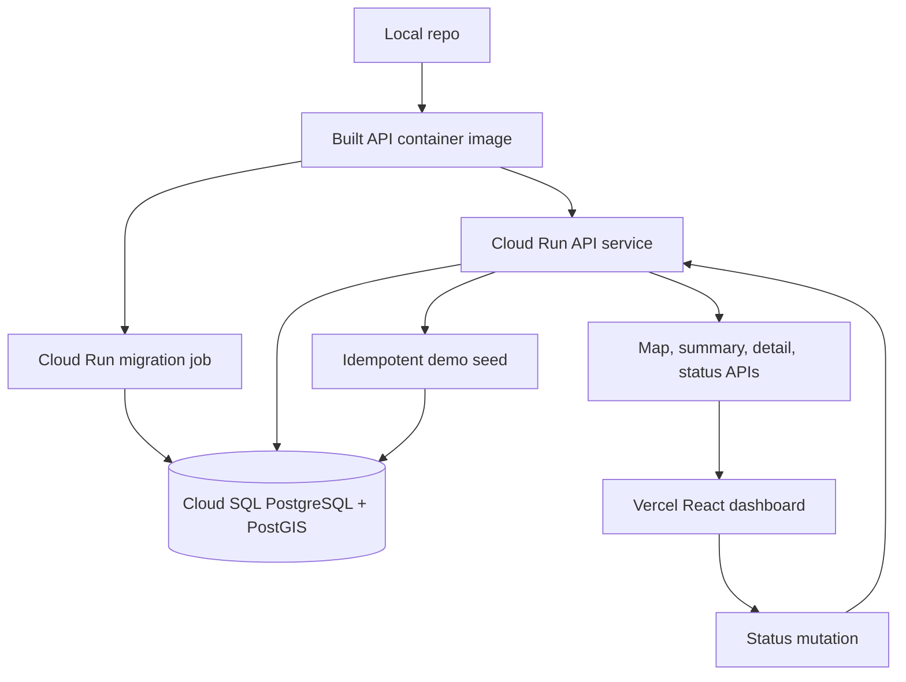
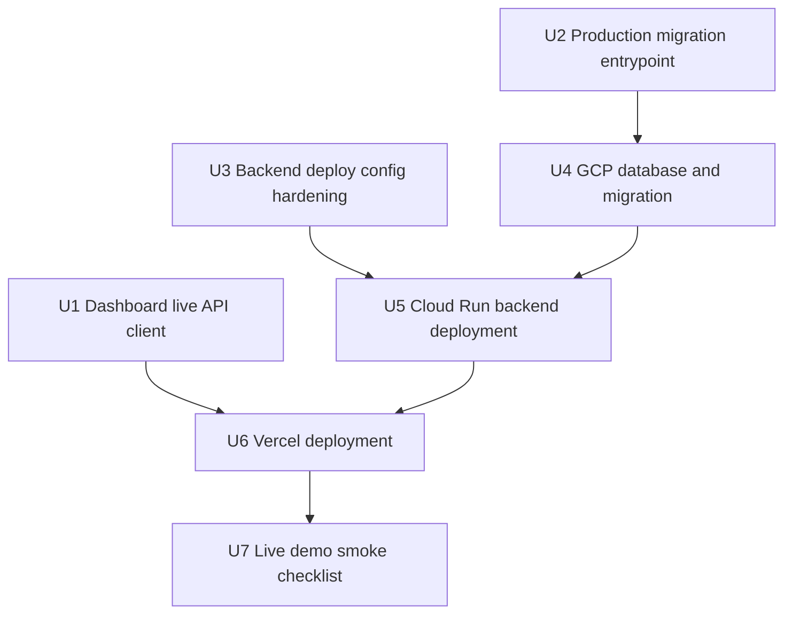

# feat: Deploy live demo stack

## Summary

Deploy the current Waywise demo as a real live stack: Vercel serves the dashboard, Cloud Run serves the Fastify API, and Cloud SQL/PostGIS stores seeded and iOS-originated impact data. The plan keeps deployment manual and documented for the MVP, while adding the small code paths needed for the dashboard to read and mutate live API data instead of local fixtures.

---

## Problem Frame

The backend/database slice now exists, but the demo is not yet a deployed product loop. The dashboard still starts from local fixture candidates, and the deploy path needs a production-safe migration mechanism before the Cloud Run image can initialize Cloud SQL reliably.

---

## Assumptions

*This plan was authored from the current request and existing brainstorm without a separate synchronous scope-confirmation round. The items below are agent inferences that should be reviewed before implementation proceeds.*

- The first deployment should be manual and runbook-driven, not Terraform or full CI/CD automation.
- The Cloud Run backend can remain publicly reachable for the demo, with CORS restricted to the Vercel dashboard origin and no dashboard auth.
- Production migrations should run through a one-off Cloud Run Job using the same built container image after adding a production migration script.
- The Vercel dashboard should use fixture data only as a local or failure fallback; the deployed production build should use the Cloud Run API.
- The Vercel production domain can be discovered during deployment, then applied back to `CORS_ORIGINS` in a second Cloud Run configuration update.

---

## Requirements

- R1. Deploy the backend API to GCP Cloud Run.
- R2. Create and configure a Cloud SQL PostgreSQL instance with PostGIS support.
- R3. Run production migrations against Cloud SQL before enabling live traffic or startup demo seeding.
- R4. Configure backend environment variables and CORS for the Vercel dashboard origin.
- R5. Connect the dashboard to the live backend API instead of local fixture data when an API base URL is configured.
- R6. Deploy the dashboard to Vercel with the Mapbox token and API base URL configured.
- R7. Preserve the backend's existing GeoJSON map contract, status update route, summary route, and demo seed path.
- R8. Keep demo seeding idempotent so Cloud Run restarts or concurrent starts do not inflate candidate confidence.
- R9. Provide clear smoke checks that prove the live dashboard reads candidates from Cloud Run and status updates persist.

**Origin actors:** A1 demo viewer, A2 iOS demo app, A3 Cloud Run backend, A4 auto-seeded fleet simulator, A5 dashboard user.

**Origin flows:** F1 recorded iOS proof, F2 candidate creation and scoring, F3 dashboard triage, F4 auto-seeded demo.

**Origin acceptance examples:** AE1 iOS event stored and affects candidate data, AE4 dashboard reads map-ready candidate data, AE5 status update persists, AE6 no-auth seeded backend populates the dashboard.

---

## Scope Boundaries

### Deferred for later

- App Store distribution.
- Production-grade passive drive detection that works reliably after app termination.
- Android support and cross-platform mobile parity.
- Machine-learning classification trained on labeled road-impact data.
- Lane-level localization.
- Rich municipal work-order integrations.
- Automatic repair dispatch or contractor routing.
- Push-based real-time dashboard updates.
- Full known-road-feature ingestion from municipal GIS systems.
- Driver-facing gamification, rewards, or reporting history.
- Full auth, user management, privacy retention workflows, and deletion-request handling.

### Outside this product's identity

- Surveillance or route-tracking product for individual drivers.
- Dashcam/computer-vision pothole detection product.
- General-purpose fleet telematics platform.
- Public complaint/social reporting network.
- Satellite or aerial imagery road-condition analysis.

### Deferred to Follow-Up Work

- iOS app implementation and TestFlight/device install flow; this deployment plan keeps the backend contract ready for the recorded iOS proof path.
- Terraform or Pulumi infrastructure-as-code for GCP and Vercel resources.
- Automated CI/CD from GitHub to Cloud Run and Vercel beyond Vercel's normal Git deploy.
- Secret Manager integration for the database password if the first demo deploy uses direct Cloud Run environment configuration.
- Custom domains, auth, rate limiting, and audit logs for a production municipal rollout.

---

## Context & Research

### Relevant Code and Patterns

- `api/Dockerfile` builds TypeScript to `dist/`, installs production dependencies in the runtime image, and starts `node dist/server.js`.
- `api/package.json` currently has `migrate` backed by `tsx src/db/migrate.ts`, which is development-safe but not runtime-image-safe after dev dependencies and `src/` are omitted.
- `api/src/config/env.ts` already supports `DATABASE_URL` for local/non-Cloud SQL deployments and Cloud SQL socket settings through `DB_USER`, `DB_PASSWORD`, `DB_NAME`, `CLOUD_SQL_CONNECTION_NAME`, and `DATABASE_SOCKET_PATH`.
- `api/src/app.ts` registers CORS through `CORS_ORIGINS`, auto-seeds only when `AUTO_SEED_DEMO=true`, and exposes the health, impact events, map, summary, status, seed, and recalculation routes.
- `api/src/routes/potholeCandidates.ts` already supports map filters for severity, status, minimum confidence, last detected age, and active-only behavior.
- `api/src/services/candidateReadService.ts` returns map candidates as a GeoJSON `FeatureCollection` with `PotholeCandidate`-compatible properties.
- `src/App.tsx` currently initializes state from `src/data/demoCandidates.ts` and performs status changes locally through `updateCandidateStatus`.
- `src/domain/candidates.ts` defines the frontend candidate shape, filtering, summary, and GeoJSON conversion behavior that live API integration should preserve.
- `docs/deployment/backend-gcp.md` already documents the backend package, Cloud Run environment, Cloud SQL socket settings, demo seeding, and smoke checks.
- `README.md` still describes the dashboard as fixture-backed and Vercel as requiring only `VITE_MAPBOX_TOKEN`.

### Institutional Learnings

- `docs/solutions/database-issues/postgres-advisory-locks-for-concurrent-clustering-2026-05-10.md` documents the advisory-lock fix for concurrent clustering and demo seeding. This deployment plan must preserve that pattern because Cloud Run can start multiple instances and replay startup seeding concurrently.

### External References

- Google Cloud documents deploying container images to Cloud Run and notes that Cloud Run imports the deployed image into the service revision.
- Google Cloud documents Cloud Run to Cloud SQL connections, including attaching Cloud SQL instances to a service and connecting through `/cloudsql/INSTANCE_CONNECTION_NAME`.
- Google Cloud documents that PostGIS is supported for Cloud SQL for PostgreSQL across major versions.
- Google Cloud documents Cloud Run Jobs as task containers that run to completion and do not serve requests.
- Google Cloud documents Cloud Run Job command and argument overrides, which supports using the API image for a migration job.
- Vercel documents project environment variables and notes that environment variable changes apply only to new deployments.
- Vercel documents Git and CLI deployment paths and that each deployment receives a unique URL.

---

## Key Technical Decisions

- Use the existing `api/` Docker image for both the Cloud Run service and a one-off migration job: this keeps runtime parity high and avoids a separate migration host.
- Add a production migration script instead of running the current development migration script in Cloud Run: the runtime image has compiled `dist/` and production dependencies, not `tsx` and `src/`.
- Keep schema migration separate from service startup: Cloud Run may run multiple instances, so startup should serve traffic and idempotently seed demo data only after schema is known-good.
- Use Cloud SQL Unix socket settings in Cloud Run: the backend already supports this configuration and Google documents `/cloudsql/INSTANCE_CONNECTION_NAME` for Cloud Run to Cloud SQL connectivity.
- Keep demo API access unauthenticated but CORS-restricted to the Vercel origin: this matches the demo requirements while making the public-mutability risk explicit.
- Add `VITE_API_BASE_URL` to the dashboard and keep fixture fallback for local development: the deployed dashboard can use live data without making local development depend on GCP.
- Let the dashboard consume the backend's GeoJSON map endpoint directly: the API already returns the same candidate property shape the current frontend expects.
- Update CORS after the Vercel production URL is known: Vercel generates deployment URLs, so the final backend allowlist depends on the frontend deployment result.

---

## Open Questions

### Resolved During Planning

- Deployment approach: use manual GCP/Vercel deployment with runbooks for the MVP, not infrastructure-as-code.
- Database connection path: use Cloud Run's Cloud SQL attachment and Unix socket configuration rather than exposing Cloud SQL directly to the public internet.
- Migration execution path: use a one-off Cloud Run Job after adding a production migration entrypoint.
- Dashboard API strategy: use live API when `VITE_API_BASE_URL` is set and retain fixtures as local fallback.

### Deferred to Implementation

- Exact GCP project ID, region, service names, database name, and Cloud SQL instance name: these are account-specific deployment inputs.
- Whether to store the Cloud SQL password directly in Cloud Run env vars or in Secret Manager for the first demo deploy: Secret Manager is preferable, but direct env configuration may be faster for a private demo project.
- Whether Vercel Preview deployments need CORS access or only the production domain: include preview origins only if the demo workflow actually needs them.
- Whether `AUTO_SEED_DEMO` should stay enabled after the recording is complete: useful for demo availability, but disabling it after seed verification reduces startup-side effects.

---

## High-Level Technical Design

> *This illustrates the intended approach and is directional guidance for review, not implementation specification. The implementing agent should treat it as context, not code to reproduce.*

Deployment should happen in this order: make the code deploy-ready, create Cloud SQL/PostGIS, run migrations, deploy Cloud Run with CORS and demo settings, seed and smoke-test the API, deploy Vercel with the live API base URL, update backend CORS to the final Vercel origin, then run browser-level dashboard smoke checks.

---

## Implementation Units

### U1. Dashboard Live API Client

**Goal:** Connect the dashboard to the deployed backend API when configured, while preserving fixture fallback for local development and test stability.

**Requirements:** R5, R7, R9.

**Dependencies:** None.

**Files:**
- Create: `src/services/waywiseApi.ts`
- Create: `src/services/waywiseApi.test.ts`
- Modify: `src/App.tsx`
- Modify: `src/App.test.tsx`
- Modify: `src/domain/candidates.ts`
- Modify: `.env.example`
- Modify: `README.md`

**Approach:**
- Add a small typed API client around the existing map, summary, detail, and status endpoints.
- Read the API base URL from a Vite environment variable and use local fixtures only when the value is unset or when an explicit fallback path is needed for local resilience.
- Convert the backend `FeatureCollection` response into the existing `PotholeCandidate[]` shape through `feature.properties`.
- Send dashboard filters to the map endpoint using the backend's existing query parameters instead of fetching all live data and filtering only in the browser.
- Make status changes call the backend status route, then update local state from the response or refresh the selected candidate.
- Surface a compact loading/error state so the deployed dashboard does not render as an empty map if the API or CORS is misconfigured.

**Execution note:** Characterize the current fixture behavior in `src/App.test.tsx` before swapping the data source so local fallback remains intentional.

**Patterns to follow:**
- Preserve the `PotholeCandidate` field names in `src/domain/candidates.ts`.
- Keep dashboard state and filtering behavior close to the current `src/App.tsx` structure.
- Use the existing Vitest and Testing Library style from `src/App.test.tsx`.

**Test scenarios:**
- Happy path: with an API base URL configured, the dashboard fetches the map endpoint, renders candidate rows from API properties, and does not depend on `demoCandidates`.
- Happy path: changing severity, status, minimum confidence, or last-detected filters sends equivalent query values to the map endpoint.
- Happy path: changing the selected candidate status calls the backend status route and updates the visible selected status.
- Edge case: with no API base URL configured, the dashboard uses fixture candidates and retains current local status behavior.
- Error path: if the map endpoint fails or returns an invalid response, the dashboard shows a useful API error state and keeps the map/detail layout intact.
- Integration: candidate summary metrics remain consistent with the candidates visible from the live API response.

**Verification:**
- A production-configured build can load candidates from a non-local API base URL.
- The fixture-backed local mode still works without GCP or Vercel credentials.
- Existing map click, detail panel, filters, and status controls continue to behave coherently.

---

### U2. Production Migration Entrypoint

**Goal:** Make database migrations runnable from the production Cloud Run container image.

**Requirements:** R2, R3.

**Dependencies:** None.

**Files:**
- Modify: `api/package.json`
- Modify: `api/Dockerfile`
- Modify: `api/src/db/migrate.ts`
- Modify: `package.json`
- Modify: `docs/deployment/backend-gcp.md`
- Test: `api/src/db/schema.integration.test.ts`
- Test: `api/src/config/env.test.ts`

**Approach:**
- Add a production migration script that runs the compiled migration module from `dist/`.
- Keep the current development migration script for local TypeScript iteration.
- Confirm the runtime image contains everything the production migration path needs: compiled code, SQL migrations, production dependencies, and environment parsing.
- Document that migrations run as a release step before `AUTO_SEED_DEMO=true` is enabled.
- Keep migration behavior ordered and idempotent; do not add schema mutation to API startup.

**Patterns to follow:**
- Preserve the existing `api/src/db/migrate.ts` migration runner.
- Preserve the current Docker runtime image shape unless implementation proves a small Dockerfile change is necessary.

**Test scenarios:**
- Happy path: after an API build, the production migration script applies migrations against local PostGIS using production-style environment values.
- Edge case: running the production migration script a second time does not reapply completed migrations.
- Error path: missing database connection values fail clearly before partially running migrations.
- Integration: schema integration tests still pass after migrations are applied through the production path.

**Verification:**
- The same image intended for Cloud Run can execute migrations in a one-off job before serving traffic.
- Development migration ergonomics remain unchanged.

---

### U3. Backend Deployment Configuration Hardening

**Goal:** Tighten backend configuration and docs around Cloud Run, Cloud SQL socket settings, CORS, and demo seeding before the service is deployed.

**Requirements:** R1, R4, R7, R8.

**Dependencies:** U2.

**Files:**
- Modify: `api/.env.example`
- Modify: `api/src/config/env.ts`
- Modify: `api/src/config/env.test.ts`
- Modify: `api/src/app.test.ts`
- Modify: `docs/deployment/backend-gcp.md`

**Approach:**
- Make the expected Cloud Run environment explicit in examples, including database socket settings, demo flags, and CORS origins.
- Validate or document invalid partial database configuration cases so deployment failures are easy to diagnose.
- Confirm CORS allows only configured browser origins while still allowing same-origin or non-browser server calls.
- Keep `AUTO_SEED_DEMO` separate from migrations and preserve advisory-lock-backed idempotency.
- Prefer operational smoke through existing data endpoints rather than adding a new DB health endpoint unless implementation finds a concrete need.

**Patterns to follow:**
- Reuse the existing `loadEnv` style in `api/src/config/env.ts`.
- Preserve the CORS registration pattern in `api/src/app.ts`.
- Follow the deployment notes already started in `docs/deployment/backend-gcp.md`.

**Test scenarios:**
- Happy path: production Cloud SQL socket settings load into a valid `ApiConfig`.
- Happy path: CORS accepts the configured Vercel origin and rejects an unrelated browser origin.
- Edge case: multiple comma-separated CORS origins parse correctly for local plus Vercel development.
- Error path: invalid booleans, ports, and clustering numbers still fail with clear configuration errors.
- Integration: `AUTO_SEED_DEMO=true` remains covered by startup seeding tests without creating duplicate demo data.

**Verification:**
- The service can be configured for Cloud Run without relying on local `.env` assumptions.
- CORS misconfiguration has targeted tests and a clear runbook path.

---

### U4. GCP Database and Migration Runbook

**Goal:** Create a deployment runbook for provisioning Cloud SQL/PostGIS and executing the production migration path against it.

**Requirements:** R2, R3, R8.

**Dependencies:** U2, U3.

**Files:**
- Create: `docs/deployment/live-demo-gcp.md`
- Modify: `docs/deployment/backend-gcp.md`

**Approach:**
- Define the required GCP inputs: project, region, Cloud SQL instance, database, database user, service account, and Cloud SQL connection name.
- Document Cloud SQL PostgreSQL instance setup and PostGIS enablement through the existing migrations.
- Document the one-off Cloud Run Job migration path using the same API image and production migration entrypoint.
- Keep Cloud SQL and Cloud Run in the same region for latency and cost reasons.
- Include a rollback note for failed migrations: stop before serving traffic, inspect job logs, and avoid enabling startup seeding until schema is verified.

**Test scenarios:**
- Test expectation: none for local automated tests because this unit provisions cloud resources. Verification is through the smoke checks and GCP resource state named below.

**Verification:**
- Cloud SQL exists with the Waywise database and user.
- PostGIS is installed by the migration path.
- The migrations table shows all expected migrations applied exactly once.
- The migration job exits successfully and can be inspected in Cloud Run job logs.

---

### U5. Cloud Run Backend Deployment

**Goal:** Deploy the API service to Cloud Run, attach it to Cloud SQL, configure environment variables, seed demo data, and verify live API endpoints.

**Requirements:** R1, R4, R7, R8, R9.

**Dependencies:** U3, U4.

**Files:**
- Modify: `docs/deployment/live-demo-gcp.md`
- Modify: `docs/deployment/backend-gcp.md`
- Modify: `README.md`

**Approach:**
- Build and publish the API container image to Artifact Registry or the selected GCP container registry.
- Deploy the image as the Cloud Run API service with the Cloud SQL instance attached.
- Configure production environment values, including Cloud SQL socket settings, CORS origins, demo mode, and clustering parameters.
- Start with `AUTO_SEED_DEMO=false` until migrations and API connectivity are verified, then enable seeding or call the seed endpoint deliberately.
- Smoke-test health, seed, map, detail, summary, and status endpoints before wiring Vercel production traffic.
- Record the Cloud Run service URL as the value that will become `VITE_API_BASE_URL`.

**Test scenarios:**
- Test expectation: no additional local test file for the deployment operation itself. The service behavior remains covered by existing route, service, repository, and integration tests.

**Verification:**
- `GET /api/health` responds from the Cloud Run URL.
- Demo seeding creates candidates once for the configured seed.
- `GET /api/pothole-candidates/map` returns a non-empty GeoJSON `FeatureCollection`.
- `GET /api/dashboard/summary` returns counts aligned with the map response.
- `PATCH /api/pothole-candidates/:id/status` persists and is visible on a follow-up read.
- Cloud Run logs do not show database connection, migration, startup seed, or CORS errors during smoke.

---

### U6. Vercel Dashboard Deployment

**Goal:** Deploy the dashboard to Vercel with live backend configuration, then close the CORS loop against the final Vercel origin.

**Requirements:** R4, R5, R6, R9.

**Dependencies:** U1, U5.

**Files:**
- Modify: `.env.example`
- Modify: `README.md`
- Modify: `docs/deployment/live-demo-gcp.md`
- Create: `docs/deployment/vercel-dashboard.md`

**Approach:**
- Configure Vercel project environment variables for the Mapbox token and Cloud Run API base URL.
- Deploy the root Vite dashboard as the Vercel project.
- Capture the production deployment origin and update the Cloud Run `CORS_ORIGINS` allowlist to include that exact origin.
- Trigger a new Vercel deployment after environment variable changes because Vercel applies env changes only to new deployments.
- Decide whether preview domains need backend CORS access; avoid adding wildcard origins for the demo unless there is a clear need.

**Test scenarios:**
- Happy path: production dashboard loads candidates from Cloud Run and shows the live-data state.
- Happy path: map heat areas, candidate list, metric tiles, detail panel, and status selector render from API data.
- Error path: if Cloud Run CORS rejects the Vercel origin, the dashboard shows the API error state rather than silently falling back to misleading production fixtures.
- Integration: after a status change in the dashboard, a hard refresh still shows the persisted backend status.

**Verification:**
- The Vercel production URL loads without local fixture-only behavior.
- Browser network requests target the Cloud Run API base URL.
- No CORS errors appear in the browser console for map, summary, detail, or status calls.
- Status updates survive refresh and are visible from the backend API.

---

### U7. Live Demo Smoke Checklist

**Goal:** Capture an end-to-end checklist that proves the deployed stack is ready for the recorded/live demo.

**Requirements:** R1, R2, R3, R4, R5, R6, R9.

**Dependencies:** U5, U6.

**Files:**
- Create: `docs/deployment/live-demo-checklist.md`
- Modify: `README.md`

**Approach:**
- Add a concise pre-demo checklist covering Cloud SQL health, migration state, Cloud Run health, seeded candidates, Vercel environment values, CORS, Mapbox rendering, and status persistence.
- Include a short failure triage section for empty maps, CORS failures, stale Vercel env vars, failed migration jobs, and repeated seed confusion.
- Keep the checklist separate from the detailed runbooks so it is usable immediately before recording.

**Test scenarios:**
- Test expectation: none for documentation-only checklist content. The checklist points to endpoint and browser checks already covered by U5 and U6 verification.

**Verification:**
- A reviewer can follow the checklist from a fresh browser and confirm the demo is live without reading the implementation code.
- The checklist distinguishes API/data failures from map-token/rendering failures.

---

## System-Wide Impact

- **Interaction graph:** The dashboard will add networked state to the existing local UI; Cloud Run service startup will depend on database connectivity only when API routes or auto-seeding touch the pool.
- **Error propagation:** API fetch errors should be visible in the dashboard; migration errors should fail the one-off job before traffic and seeding; CORS errors should not be hidden by fixture fallback in production.
- **State lifecycle risks:** Migrations must precede seeding; demo seeding must remain idempotent under Cloud Run restarts; status changes must persist across candidate rescoring and dashboard refreshes.
- **API surface parity:** The live dashboard should use the same candidate properties currently used by fixtures, so the map, detail panel, filters, and summary remain coherent.
- **Integration coverage:** Local tests prove API-client behavior and config parsing; cloud smoke checks prove Cloud SQL, Cloud Run, Vercel, CORS, and Mapbox are connected.
- **Unchanged invariants:** The backend map endpoint remains GeoJSON, the iOS impact event ingestion route remains available, and no dashboard authentication is added for the demo.

---

## Alternative Approaches Considered

- Terraform-first infrastructure: better long-term repeatability, but slower for this demo and outside the current MVP scope.
- Running migrations from a developer laptop through Cloud SQL Auth Proxy: viable fallback, but less representative than a Cloud Run Job using the same image and environment style as production.
- Running migrations during API startup: rejected because Cloud Run can start multiple instances and startup should not mutate schema.
- Leaving the dashboard fixture-backed for production: rejected because the origin document explicitly requires the deployed dashboard to read map-ready candidate data from the backend.
- Opening backend CORS broadly for convenience: rejected because no-auth demo APIs should still avoid unnecessary browser exposure.

---

## Success Metrics

- Cloud Run API is reachable at a stable service URL and returns healthy status.
- Cloud SQL has all migrations applied and PostGIS enabled.
- Demo seed data produces non-empty pothole candidate GeoJSON from the live API.
- Vercel production dashboard loads candidates from the Cloud Run URL with no CORS errors.
- Status changes made in the dashboard persist after refresh and match the backend detail response.
- Local dashboard development still works without a live API by using fixture fallback.

---

## Phased Delivery

### Phase 1: Make the repo deploy-ready

- Implement U1, U2, and U3.
- Verify local tests, API build, dashboard build, Docker build, production migration path, and fixture fallback.

### Phase 2: Bring up GCP backend infrastructure

- Implement U4 and U5.
- Verify Cloud SQL migrations, Cloud Run service health, demo seeding, map data, summary data, and status persistence.

### Phase 3: Deploy the dashboard and close the loop

- Implement U6.
- Verify Vercel production reads the Cloud Run API and update Cloud Run CORS to the final Vercel origin.

### Phase 4: Demo readiness

- Implement U7.
- Run the pre-demo checklist immediately before recording or presenting.

---

## Risks & Dependencies

| Risk | Mitigation |
|------|------------|
| Runtime image cannot run migrations | Add and verify a production migration entrypoint against local PostGIS before creating the Cloud Run Job. |
| CORS blocks the Vercel dashboard | Deploy backend and frontend in two passes, then update `CORS_ORIGINS` with the exact Vercel production origin. |
| Vercel uses stale environment variables | Redeploy after environment variable changes because Vercel applies them only to new deployments. |
| Startup seeding duplicates demo evidence | Preserve the advisory-lock/idempotency pattern documented in `docs/solutions/database-issues/postgres-advisory-locks-for-concurrent-clustering-2026-05-10.md`. |
| Cloud SQL socket path is too long | Keep project, region, and instance naming concise enough for Unix socket path limits. |
| No-auth demo API can be mutated publicly | Limit demo data sensitivity, restrict browser origins through CORS, avoid secrets in the frontend, and treat auth/rate limiting as a follow-up before real users. |
| Cloud resource credentials are unavailable during implementation | Keep the runbooks and code changes independently verifiable locally, then execute cloud steps once GCP/Vercel access is available. |

---

## Documentation / Operational Notes

- Update `docs/deployment/backend-gcp.md` rather than replacing it; it already contains the backend-specific deployment notes.
- Add separate live-demo runbooks for GCP and Vercel so pre-demo operators do not need to infer sequence from implementation details.
- Update `README.md` to describe local fixture mode, live API mode, backend deployment docs, and Vercel env vars.
- Record final deployed URLs and environment variable names in deployment docs without committing secrets.
- Keep post-deploy smoke checks lightweight and repeatable.

---

## Sources & References

- **Origin document:** [docs/brainstorms/2026-05-10-passive-pothole-detection-requirements.md](../brainstorms/2026-05-10-passive-pothole-detection-requirements.md)
- **Completed backend/database plan:** [docs/plans/2026-05-10-001-feat-backend-database-plan.md](2026-05-10-001-feat-backend-database-plan.md)
- **Backend deployment doc:** [docs/deployment/backend-gcp.md](../deployment/backend-gcp.md)
- **Concurrent seeding/clustering learning:** [docs/solutions/database-issues/postgres-advisory-locks-for-concurrent-clustering-2026-05-10.md](../solutions/database-issues/postgres-advisory-locks-for-concurrent-clustering-2026-05-10.md)
- **Dashboard live-data entry point:** `src/App.tsx`
- **Dashboard candidate domain:** `src/domain/candidates.ts`
- **Backend config:** `api/src/config/env.ts`
- **Backend app wiring:** `api/src/app.ts`
- **Backend map/status routes:** `api/src/routes/potholeCandidates.ts`
- **Backend candidate read service:** `api/src/services/candidateReadService.ts`
- **Cloud Run container deployment:** https://cloud.google.com/run/docs/deploying
- **Cloud Run build sources to containers:** https://cloud.google.com/run/docs/building/containers
- **Cloud Run to Cloud SQL PostgreSQL:** https://cloud.google.com/sql/docs/postgres/connect-run
- **Cloud SQL PostgreSQL extensions/PostGIS:** https://cloud.google.com/sql/docs/postgres/extensions
- **Cloud Run Jobs:** https://cloud.google.com/run/docs/create-jobs
- **Cloud Run Job entrypoint and args:** https://cloud.google.com/run/docs/configuring/jobs/containers
- **Vercel environment variables:** https://vercel.com/docs/projects/environment-variables
- **Vercel deployments:** https://vercel.com/docs/deployments/deployment-methods
